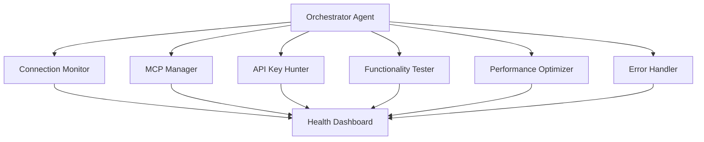

# 🤖 BDBT Autonomous Agent System

## Overview
A self-managing agent team that continuously ensures the BDBT app is functional, connected, and optimized.

## 🎯 Agent Team Structure

### 1. **Connection Monitor Agent** 🔌
- Checks Supabase connection every 5 minutes
- Validates API keys are active
- Tests database queries
- Auto-reconnects if connection drops

### 2. **MCP Manager Agent** 🛠️
- Ensures all MCP servers are running
- Monitors MCP health status
- Restarts failed MCP connections
- Manages MCP configurations

### 3. **API Key Hunter Agent** 🔑
- Uses Puppeteer to retrieve API keys from dashboards
- Securely stores keys in environment
- Rotates keys when needed
- Monitors key expiration dates

### 4. **Functionality Tester Agent** ✅
- Runs automated tests every hour
- Checks all CRUD operations
- Validates UI components render
- Tests user flows end-to-end

### 5. **Performance Optimizer Agent** ⚡
- Monitors app performance metrics
- Identifies slow queries
- Suggests optimizations
- Auto-implements approved fixes

### 6. **Error Handler Agent** 🚨
- Catches and logs all errors
- Attempts automatic fixes
- Escalates critical issues
- Maintains error history

## 🔄 Agent Communication Flow



## 🚀 Implementation Plan

### Phase 1: Core Infrastructure
1. Set up agent orchestrator
2. Create health monitoring dashboard
3. Implement basic agent communication

### Phase 2: Connection Agents
1. Build Supabase connection monitor
2. Create MCP health checker
3. Implement auto-reconnection logic

### Phase 3: Automation Agents
1. Puppeteer API key retrieval system
2. Automated testing framework
3. Performance monitoring tools

### Phase 4: Intelligence Layer
1. Self-healing capabilities
2. Predictive maintenance
3. Auto-optimization features

## 📁 File Structure

```
agents/
├── orchestrator/
│   ├── index.ts         # Main orchestrator
│   └── scheduler.ts     # Task scheduling
├── monitors/
│   ├── connection.ts    # Connection monitoring
│   ├── mcp.ts          # MCP health checks
│   └── performance.ts   # Performance tracking
├── automation/
│   ├── apiKeyHunter.ts  # Puppeteer API retrieval
│   ├── tester.ts        # Automated testing
│   └── optimizer.ts     # Auto-optimization
├── dashboard/
│   ├── health.tsx       # Health dashboard UI
│   └── logs.tsx         # Agent activity logs
└── config/
    ├── agents.json      # Agent configurations
    └── schedules.json   # Task schedules
```

## 🔧 Key Technologies

- **Puppeteer**: Web automation for API key retrieval
- **Node-cron**: Scheduled agent tasks
- **Socket.io**: Real-time agent communication
- **Playwright**: Alternative to Puppeteer for testing
- **Winston**: Comprehensive logging
- **Bull**: Job queue for agent tasks

## 💡 Smart Features

### Auto-Recovery
- Detects failures and attempts fixes
- Rolls back problematic changes
- Maintains service continuity

### Predictive Maintenance
- Analyzes patterns to prevent issues
- Suggests proactive improvements
- Schedules maintenance windows

### Intelligent Reporting
- Daily health summaries
- Critical issue alerts
- Performance trend analysis

## 🎨 Example Agent Implementation

```typescript
// Connection Monitor Agent
class ConnectionMonitorAgent {
  private supabase: SupabaseClient;
  private status: 'healthy' | 'degraded' | 'down' = 'healthy';
  
  async checkHealth(): Promise<HealthStatus> {
    try {
      // Test database connection
      const { data, error } = await this.supabase
        .from('tips')
        .select('count')
        .limit(1);
      
      if (error) throw error;
      
      // Test authentication
      const { data: { user } } = await this.supabase.auth.getUser();
      
      // Test realtime subscription
      const channel = this.supabase.channel('test');
      await channel.subscribe();
      channel.unsubscribe();
      
      return {
        status: 'healthy',
        timestamp: new Date(),
        details: {
          database: 'connected',
          auth: user ? 'authenticated' : 'anonymous',
          realtime: 'connected'
        }
      };
    } catch (error) {
      return this.handleError(error);
    }
  }
  
  private async attemptRecovery(): Promise<void> {
    // Implement recovery logic
  }
}
```

## 🚦 Getting Started

1. **Install Dependencies**
   ```bash
   npm install puppeteer node-cron socket.io winston bull
   ```

2. **Configure Agents**
   ```bash
   cp agents/config/agents.example.json agents/config/agents.json
   ```

3. **Start Orchestrator**
   ```bash
   npm run agents:start
   ```

4. **Monitor Dashboard**
   ```bash
   npm run agents:dashboard
   ```

## 🎯 Success Metrics

- **Uptime**: 99.9% availability
- **Recovery Time**: < 30 seconds
- **API Success Rate**: > 99%
- **Test Coverage**: 100% critical paths
- **Performance**: < 100ms response time

## 🔮 Future Enhancements

- AI-powered issue prediction
- Multi-app orchestration
- Cloud deployment automation
- Advanced analytics dashboard
- Integration with monitoring services