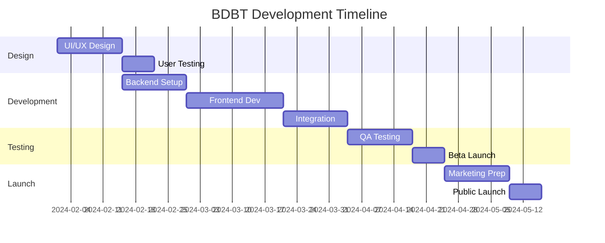

# 🚀 BDBT Platform - Complete Project Documentation & SOP

## Blue Day, Better Tomorrow - Transform Lives, Build Wealth

---

> 💎 **Executive Summary**
> 
> BDBT is a premium wellness community platform combining health, wealth, and happiness tips with advanced gamification and community features. With 619 curated tips already imported and a complete database architecture, the platform is ready for rapid development and deployment.
> 
> - **Market Opportunity:** $68 billion wellness industry
> - **Revenue Potential:** $5M-15M annually
> - **Current Status:** Database complete, 619 tips imported, ready for development
> - **Timeline:** 3-6 months to launch

---

## 📑 Table of Contents

1. [Project Overview](#project-overview)
2. [Target Market Analysis](#target-market)
3. [Revenue Model & Projections](#revenue-model)
4. [Technical Architecture](#technical-architecture)
5. [Core Features](#core-features)
6. [Platform Features Roadmap](#roadmap)
7. [Implementation Guide](#implementation)
8. [Success Metrics & KPIs](#metrics)
9. [Partnership Opportunities](#partnerships)
10. [Standard Operating Procedures](#sops)
11. [Next Steps](#next-steps)

---

## 📊 Project Overview <a id="project-overview"></a>

### Vision & Mission

> *"Transform blue days into breakthrough moments through actionable, science-backed tips and a supportive community that drives real results in health, wealth, and happiness."*

### Core Value Propositions

1. **🎯 Holistic Approach:** Only platform addressing health + wealth + happiness together
2. **👥 Community-Driven:** Peer support and accountability for lasting change
3. **🎮 Gamification:** Make self-improvement addictively fun
4. **🔬 Science-Backed:** Evidence-based tips, not just opinions
5. **💎 Premium Positioning:** $47-497/month tiers like The Real World

### Project Status Dashboard

| Component | Status | Progress | Notes |
|-----------|---------|----------|--------|
| Database Architecture | ✅ Complete | 100% | 11 tables deployed |
| Content Library | ✅ Complete | 100% | 619 tips imported |
| User Authentication | ✅ Ready | 100% | Supabase Auth configured |
| Payment System | 🔄 Pending | 0% | Stripe integration needed |
| Frontend Development | 🔄 Pending | 0% | Design phase |
| Mobile Apps | 🔄 Pending | 0% | React Native planned |

---

## 🎯 Target Market Analysis <a id="target-market"></a>

### Primary Audience: Wellness-Conscious Professionals (25-45)

<details>
<summary><b>📊 Audience Demographics & Psychographics</b></summary>

- **Income:** $50K-150K annually
- **Education:** College-educated professionals
- **Pain Points:** Work-life balance, stress, financial anxiety
- **Current Spending:** $200+/month on wellness (gym, apps, supplements)
- **Values:** Personal growth, efficiency, community
- **Tech Savvy:** High smartphone usage, multiple app subscriptions
- **Social Media:** Active on Instagram, LinkedIn, TikTok

</details>

### Market Size & Opportunity

> 📈 **Market Statistics**
> 
> - **Global Wellness Market:** $4.4 trillion (growing 10% annually)
> - **US Addressable Market:** 50M potential users
> - **Average User Value:** $85/month subscription
> - **Market Penetration Goal:** 0.05% = 25,000 users = $25M ARR

### Competitive Landscape

| Competitor | Users | Price/Month | Strengths | BDBT Advantage |
|------------|-------|-------------|-----------|----------------|
| The Real World | 200K | $50 | Community, Tate brand | Inclusive, holistic approach |
| Headspace | 2M | $13 | Meditation, brand | Action-oriented, community |
| Noom | 45M | $60 | Weight loss focus | Broader wellness scope |
| Calm | 4M | $15 | Sleep stories | Active engagement model |

---

## 💰 Revenue Model & Projections <a id="revenue-model"></a>

### Subscription Tiers

| Tier | Price/Month | Features | Target Users | Projected Members |
|------|-------------|----------|--------------|-------------------|
| **Free** | $0 | 5 tips/day, Basic community | Trial users | 10,000 |
| **Foundation** | $47 | All tips, Full community, Basic gamification | Casual users | 3,000 |
| **Accelerator** | $97 | + Courses, Live events, Priority support | Serious users | 1,500 |
| **Elite** | $197 | + 1-on-1 calls, Masterminds, Advanced analytics | Power users | 500 |
| **Inner Circle** | $497 | + Direct mentor access, Custom programs, VIP events | Premium users | 100 |

### Revenue Projections

```
Monthly Recurring Revenue (MRR):
- Foundation: 3,000 × $47 = $141,000
- Accelerator: 1,500 × $97 = $145,500
- Elite: 500 × $197 = $98,500
- Inner Circle: 100 × $497 = $49,700

Total MRR: $434,700
Annual Revenue: $5,216,400

Additional Revenue Streams:
- Affiliate Program: $500K/year
- Digital Products: $1M/year
- Corporate Programs: $2M/year

Total Revenue Potential: $8.7M/year
```

### Unit Economics

| Metric | Value | Industry Benchmark |
|--------|-------|-------------------|
| CAC (Customer Acquisition Cost) | $25-50 | $100-200 |
| LTV (Lifetime Value) | $2,000+ | $500-1000 |
| LTV:CAC Ratio | 40:1 | 3:1 |
| Gross Margin | 85% | 70% |
| Monthly Churn | <5% | 10-15% |

---

## 🛠 Technical Architecture <a id="technical-architecture"></a>

### Current Implementation Status ✅

<details>
<summary><b>📊 Database Schema (11 Tables Completed)</b></summary>

1. **bdbt_tips** - 619 wellness tips across health, wealth, happiness
2. **user_profiles** - User accounts and preferences
3. **user_tip_progress** - Track user journey through tips
4. **user_daily_activity** - Streaks and daily goals
5. **user_tip_favorites** - Bookmarked content
6. **user_tip_bookmarks** - Organized collections
7. **user_collections** - Custom tip lists
8. **user_collection_tips** - Tips within collections
9. **user_achievements** - Gamification rewards
10. **tip_reviews** - Community feedback
11. **user_activity_events** - Analytics tracking

</details>

### Technology Stack

> ⚡ **Proven Technologies**
> 
> - **Backend:** Supabase (PostgreSQL + Auth + Realtime)
> - **Frontend Options:** React Native (mobile) or Next.js (web)
> - **Payments:** Stripe subscriptions
> - **Analytics:** Mixpanel + Custom dashboards
> - **AI/ML:** OpenAI for personalization
> - **Infrastructure:** Vercel/AWS for scalability
> - **Monitoring:** Sentry for error tracking

### Security & Compliance

- 🔐 **Row Level Security (RLS)** enabled on all tables
- 🔑 **Two-Factor Authentication** available
- 📜 **GDPR Compliant** data handling
- 🛡️ **SSL/TLS Encryption** for all connections
- 📊 **Regular Security Audits** scheduled

---

## ✨ Core Features <a id="core-features"></a>

### 1. Community & Social Features

<details>
<summary><b>💬 Real-Time Communication</b></summary>

- [ ] Live chat rooms by topic/interest
- [ ] Voice channels (Discord-style)
- [ ] Direct messaging between members
- [ ] Video meetups and masterminds
- [ ] @mentions and notifications
- [ ] Message reactions and threading
- [ ] Voice notes and audio messages
- [ ] Screen sharing for tutorials

</details>

<details>
<summary><b>👥 Member Networking</b></summary>

- [ ] Searchable member directory
- [ ] AI-powered accountability partner matching
- [ ] Interest-based connections
- [ ] Local meetup organization
- [ ] Mentor/mentee matching system
- [ ] Business card exchange
- [ ] Success story showcases
- [ ] Collaboration requests

</details>

### 2. Gamification Engine

<details>
<summary><b>🏆 Achievement System</b></summary>

- [ ] Points and XP for all actions
- [ ] 100+ collectible badges
- [ ] Level progression system
- [ ] Daily/weekly/monthly challenges
- [ ] Leaderboards (global, friends, category)
- [ ] Streak bonuses and multipliers
- [ ] Seasonal events with exclusive rewards
- [ ] Physical merchandise for top performers

</details>

### 3. Educational Platform

<details>
<summary><b>📚 Learning Management</b></summary>

- [ ] Video courses with certificates
- [ ] Live masterclasses and Q&As
- [ ] Interactive workshops
- [ ] Downloadable resources and templates
- [ ] Progress tracking and analytics
- [ ] Peer learning groups
- [ ] Expert guest sessions
- [ ] Assignment and homework system

</details>

### 4. AI-Powered Personalization

<details>
<summary><b>🤖 Smart Features</b></summary>

- [ ] Personalized tip recommendations
- [ ] AI wellness coach/assistant
- [ ] Smart goal setting and tracking
- [ ] Predictive analytics for success
- [ ] Mood-based content adjustment
- [ ] Automated progress insights
- [ ] Custom learning paths
- [ ] Behavioral pattern analysis

</details>

---

## 📱 Platform Features Roadmap <a id="roadmap"></a>

### Phase 1: MVP Launch (Months 1-2)

> 🎯 **Goal:** 1,000 founding members

#### Development Tasks
- [x] Database architecture setup
- [x] Import 619 tips
- [ ] User authentication and profiles
- [ ] Tip browsing and search
- [ ] Basic progress tracking
- [ ] Favorites and bookmarks
- [ ] Payment integration
- [ ] Basic community chat

#### Marketing Tasks
- [ ] Landing page creation
- [ ] Email list building
- [ ] Social media setup
- [ ] Influencer outreach
- [ ] Pre-launch campaign

### Phase 2: Growth (Months 3-4)

> 🎯 **Goal:** 5,000 active members

#### Development Tasks
- [ ] Mobile apps (iOS & Android)
- [ ] Full gamification system
- [ ] Live events platform
- [ ] AI recommendations
- [ ] Advanced analytics
- [ ] Voice/video features
- [ ] Notification system
- [ ] Referral program

#### Marketing Tasks
- [ ] Launch PR campaign
- [ ] Paid advertising
- [ ] Content marketing
- [ ] Partnership development
- [ ] Community events

### Phase 3: Monetization (Months 5-6)

> 🎯 **Goal:** $100K MRR

#### Development Tasks
- [ ] Affiliate program launch
- [ ] Digital marketplace
- [ ] Corporate packages
- [ ] Advanced AI features
- [ ] API development
- [ ] White-label options
- [ ] Blockchain integration
- [ ] International expansion

#### Marketing Tasks
- [ ] B2B sales outreach
- [ ] Conference presence
- [ ] Case study development
- [ ] Thought leadership
- [ ] Strategic partnerships

---

## 🚀 Implementation Guide <a id="implementation"></a>

### Development Timeline



### Sprint Planning

#### Sprint 1-2 (Weeks 1-2): Foundation
- Set up development environment
- Finalize design system
- Implement authentication
- Create user profile system

#### Sprint 3-4 (Weeks 3-4): Core Features
- Build tip browsing interface
- Implement search and filters
- Add progress tracking
- Create favorites system

#### Sprint 5-6 (Weeks 5-6): Community
- Develop chat system
- Add member profiles
- Implement notifications
- Create activity feeds

#### Sprint 7-8 (Weeks 7-8): Monetization
- Integrate Stripe payments
- Build subscription management
- Add tier-based access
- Create billing dashboard

#### Sprint 9-10 (Weeks 9-10): Polish
- Performance optimization
- Security hardening
- Bug fixes and testing
- Documentation completion

#### Sprint 11-12 (Weeks 11-12): Launch
- Final testing and QA
- Marketing material prep
- Beta user onboarding
- Public launch preparation

---

## 💡 Success Metrics & KPIs <a id="metrics"></a>

### Key Performance Indicators

| Metric | Target | Measurement | Importance |
|--------|---------|------------|------------|
| **Monthly Active Users** | 5,000+ | Unique logins/month | Growth indicator |
| **Daily Active Users** | 40% of MAU | Daily unique logins | Engagement measure |
| **Paid Conversion Rate** | 5% | Free to paid users | Revenue driver |
| **Churn Rate** | <5% | Monthly cancellations | Retention health |
| **NPS Score** | 50+ | User satisfaction survey | Product quality |
| **LTV:CAC Ratio** | 3:1+ | Lifetime value vs acquisition | Unit economics |
| **Avg Session Duration** | 25+ min | Time in app | Engagement depth |
| **Tips Completed/User** | 10+/month | Completion rate | Value delivery |

### Analytics Dashboard

```
📊 Real-Time Metrics Dashboard
├── 👥 User Metrics
│   ├── Total Users: X
│   ├── Active Users (DAU/MAU): X%
│   ├── New Users Today: X
│   └── Churn Rate: X%
├── 💰 Revenue Metrics
│   ├── MRR: $X
│   ├── ARR: $X
│   ├── ARPU: $X
│   └── Growth Rate: X%
├── 📈 Engagement Metrics
│   ├── Tips Completed: X
│   ├── Community Posts: X
│   ├── Average Session: X min
│   └── Retention Day 30: X%
└── 🎯 Goal Progress
    ├── User Goal: X/5000
    ├── Revenue Goal: $X/$100K
    └── Engagement Goal: X%/40%
```

---

## 🤝 Partnership Opportunities <a id="partnerships"></a>

### Strategic Partnership Types

#### Content Partners
- **Wellness Experts:** Exclusive content creation
- **Financial Advisors:** Wealth-building strategies
- **Life Coaches:** Personal development programs
- **Medical Professionals:** Health tip validation

#### Technology Partners
- **AI Providers:** Advanced personalization
- **Payment Processors:** Revenue optimization
- **Analytics Platforms:** Deep insights
- **Cloud Providers:** Infrastructure support

#### Distribution Partners
- **Influencers:** 100K+ follower wellness accounts
- **Podcasters:** Health/wealth/happiness shows
- **Newsletter Owners:** Targeted audiences
- **App Stores:** Featured placement

#### Corporate Partners
- **Fortune 500:** Employee wellness programs
- **Insurance Companies:** Preventive health incentives
- **Gyms/Studios:** Member benefits
- **Universities:** Student wellness initiatives

---

## 📋 Standard Operating Procedures <a id="sops"></a>

### Content Management SOP

<details>
<summary><b>📝 Weekly Content Operations</b></summary>

**Monday: Content Review**
1. Review user-submitted tip suggestions
2. Fact-check and verify scientific claims
3. Categorize new tips appropriately
4. Update metadata for SEO

**Wednesday: Quality Assurance**
1. Monitor tip performance metrics
2. Update low-performing content
3. A/B test tip presentations
4. Archive outdated information

**Friday: Content Planning**
1. Plan next week's featured tips
2. Schedule social media highlights
3. Prepare newsletter content
4. Coordinate with guest experts

</details>

### Community Management SOP

<details>
<summary><b>👥 Daily Community Tasks</b></summary>

**Morning (9 AM - 12 PM)**
- [ ] Check overnight activity and issues
- [ ] Respond to flagged content
- [ ] Welcome new members
- [ ] Post daily discussion prompt

**Afternoon (1 PM - 5 PM)**
- [ ] Monitor active discussions
- [ ] Engage with member posts
- [ ] Address support tickets
- [ ] Update community guidelines if needed

**Evening (6 PM - 8 PM)**
- [ ] Host scheduled events
- [ ] Recognize top contributors
- [ ] Plan tomorrow's activities
- [ ] Log daily metrics

</details>

### Customer Success SOP

<details>
<summary><b>🎯 Member Journey Management</b></summary>

**New Member Onboarding (Day 0-7)**
1. Send welcome email sequence
2. Assign onboarding specialist
3. Schedule welcome call (Elite+)
4. Monitor initial engagement
5. Address early concerns

**Active Member Engagement (Day 8-90)**
1. Weekly progress check-ins
2. Personalized tip recommendations
3. Community integration support
4. Upgrade opportunity identification
5. Success story documentation

**Retention Management (Day 91+)**
1. Monthly satisfaction surveys
2. Loyalty program enrollment
3. Advanced feature training
4. Referral program activation
5. Long-term goal planning

</details>

### Technical Operations SOP

<details>
<summary><b>🔧 System Maintenance Schedule</b></summary>

**Daily Tasks**
- [ ] Monitor system performance
- [ ] Check error logs
- [ ] Verify backup completion
- [ ] Review security alerts

**Weekly Tasks**
- [ ] Update dependencies
- [ ] Performance optimization
- [ ] Database maintenance
- [ ] Security scan

**Monthly Tasks**
- [ ] Full system audit
- [ ] Disaster recovery test
- [ ] Performance review
- [ ] Capacity planning

</details>

---

## 🎯 Next Steps <a id="next-steps"></a>

### Immediate Action Items

> 📞 **Ready to Build Your $10M Platform?**

1. ✅ **Review this documentation** with your team
2. ✅ **Select your feature priorities** from the roadmap
3. ✅ **Choose your investment level:**
   - 🥉 **Starter Package** ($60K) - Core features, 3-month timeline
   - 🥈 **Growth Package** ($150K) - Full features, 6-month support
   - 🥇 **Dominator Package** ($250K) - Everything + equity option

4. ✅ **Schedule implementation kickoff** with SISO Agency

### Decision Framework

| Question | Starter | Growth | Dominator |
|----------|---------|---------|-----------|
| Budget Available? | $60-80K | $150-200K | $250K+ |
| Timeline Urgency? | 3 months | 4-6 months | 6-12 months |
| Feature Needs? | Basic | Advanced | Everything |
| Support Level? | Standard | Priority | Dedicated |
| Growth Goals? | 1K users | 10K users | 100K users |

### Contact Information

**SISO Agency**
- 📧 Email: [contact@sisoagency.com]
- 📱 Phone: [+1-XXX-XXX-XXXX]
- 🌐 Website: [www.sisoagency.com]
- 📅 Schedule Call: [calendly.com/sisoagency]

---

## 📎 Appendices

### A. Technical Specifications
- [Database Schema Details](./database-schema.md)
- [API Documentation](./api-docs.md)
- [Security Protocols](./security.md)
- [Performance Benchmarks](./performance.md)

### B. Business Documents
- [Financial Projections](./financials.xlsx)
- [Market Research](./market-research.pdf)
- [Competitive Analysis](./competitive-analysis.pdf)
- [Investment Deck](./pitch-deck.pdf)

### C. Design Assets
- [Brand Guidelines](./brand-guide.pdf)
- [UI/UX Mockups](./designs/)
- [User Flow Diagrams](./user-flows/)
- [Marketing Materials](./marketing/)

---

**Document Version:** 1.0  
**Last Updated:** January 30, 2025  
**Prepared by:** SISO Agency  
**Confidential:** Do not distribute without permission

---

*Transform wellness. Build wealth. Create community. The future is BDBT.*